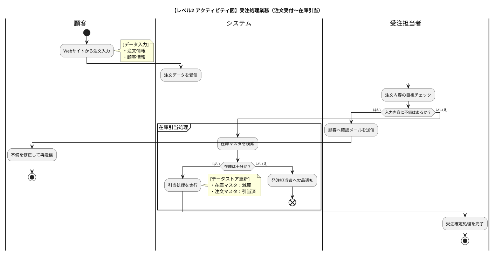

```plantuml
@startuml
title 【レベル2 アクティビティ図】受注処理業務（注文受付〜在庫引当）

skinparam maxmessagesize 150
skinparam ParticipantPadding 10

|顧客|
start
:Webサイトから注文入力;
note right
  [データ入力]
  ・注文情報
  ・顧客情報
end note

|システム|
:注文データを受信;

|受注担当者|
:注文内容の目視チェック;

if (入力内容に不備はあるか？) then (はい)

  |受注担当者|
  :顧客へ確認メールを送信;

  |顧客|
  :不備を修正して再送信;
  stop
else (いいえ)

  |システム|
  partition 在庫引当処理 {
    :在庫マスタを検索;
    if (在庫は十分か？) then (はい)
      :引当処理を実行;
      note right
        [データストア更新]
        ・在庫マスタ：減算
        ・注文マスタ：引当済
      end note
    else (いいえ)
      :発注担当者へ欠品通知;
      end
    endif
  }

  |受注担当者|
  :受注確定処理を完了;
  stop
endif

@enduml
```
